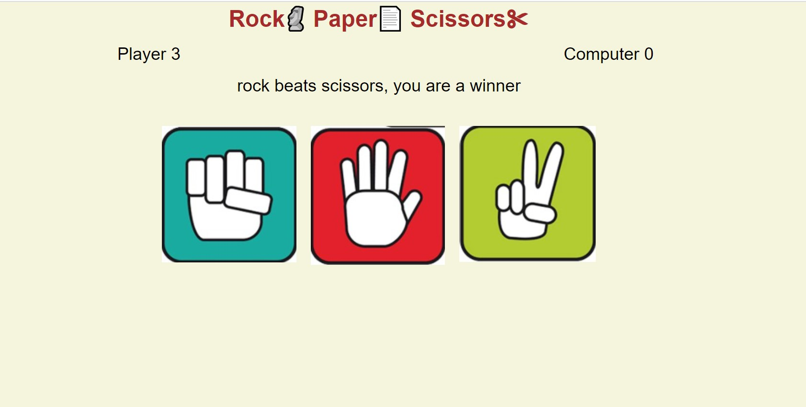
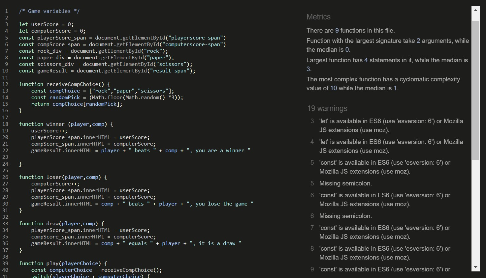

# Rock - Paper - Scissors

# Introduction
Project milestone 2 for Code Institute Full-stack development program: JavaScript Essentials.

Rock/paper/scissors is a game that is played between a **player** and the **computer**.

The familiar game of Rock, Paper, Scissors is played like this: at the same time, two players display one of three symbols: a rock, paper, or scissors. A rock beats scissors, scissors beat paper by cutting it, and paper beats rock by covering it. In this game the opponent is simulated by the computer

[The Live Project can be seen here](https://markp1312.github.io/Portfolio-P2-RPS/)

## README Table Content

* [Introduction](#introduction)
* [User Experience UX](#user-experience---UX)
* [Design](#Design)
    * [Wireframe](#Wireframe)
    * [Website Structure](#website-structure)
    * [Colour Scheme](#colour-scheme)
    * [Imagery](#Imagery)
    * [Typography](#typography)
    * [interactive Links](#interactive-links) 
  
* [Features](#features)  
    * [Home Page](#home-page) 
* [Future Features](#future-features)
* [How to Play](#how-to-play)
* [Technologies Used](#technologies-used)
    * [Languages Used](#languages-used)
    * [Frameworks - Libraries - Programs Used](#frameworks---libraries---programs-used)
* [Testing](#testing)
* [Deployment](#deployment-this-project)
    * [Deployment This Project](#deployment-this-project)
    * [Forking This Project](#forking-this-project)
    * [Cloning This Project](#cloning-this-project)
* [Credits](#credits)

## User Experience - UX

 ### User Stories

* As a visitor, I want to:
  
1. Play a simple game of Rock/Paper/Scissors against the computer.
2. The UI needs to be intuitive and self explanatory.
3. I want to see the scores.
4. There needs to be a 50/50 chance of winning
5. There needs to be clear messaging when a game is won.
6. There needs to be clear messaging when a game is a draw.
7. There needs to be clear messaging when a game is lost. 
   
   
## Design

### Wireframe
 

[Live Wireframe](https://lucid.app/lucidchart/f7175424-323e-400a-bd68-ebd82d3c0952/edit?invitationId=inv_623467ed-9a79-41bf-a5d6-0ae3cbe96994)

 

### Website Structure
The website has been created as a one page game.
The player score can be seen on the left and the computer score on the right
The options that the player can choose are centralised in the middle of the page and the outcome of each game will be clearly displayed after each round played.

#### Colour Scheme
The main colour for this project is Beige.
Beige is easy on the eye and gives the bright buttons a nice contrast.
For the buttons I have chosen:

Rock : Green
Paper : Red
Scissors : Yellow

 #### Typography
* Arial, Helvetica, sans-serif are being used for the fonts on the Webpage.
      
#### Imagery
* 3 images were used.
   - Rock
   - Paper
   - Scissors
   - [Source of images](https://github.com/youra199/Rock-paper-scissors)

  
## Features

### Home Page 

* When the user enters the webpage there will be a intuitive interface that invites to start playing straight away.
A main goal of the webpage is that the UI is self-explanatory and this has been achieved.

## Future Features
  
### Reset game option.

* I am planning to add a feature to reset the game and players can start over again. At the moment this can only be done by refreshing the page.

### View past choices

* I am planning to implement a table that will keep track of all the choices made by the player or the computer.
This will give a overview of the choices made by either player over the course of the game.

## How To Play

The Player will get the first turn.
When selecting either Rock / Paper or Scissors the computer makes a random selection and the winner will be decided against the game logic.

#### How to Start 

Click any of the 3 buttons (Rock, Paper or Scissors will trigger the game)

#### The Game

 A rock beats scissors, scissors beat paper by cutting it, and paper beats rock by covering it.

## Technologies Used

### Languages Used 

* [HTML5](https://en.wikipedia.org/wiki/HTML5)
* [CSS3](https://en.wikipedia.org/wiki/Cascading_Style_Sheets)
* [javaScript](https://www.javascript.com/)

### Frameworks - Libraries - Programs Used

* [Git](https://git-scm.com/)
    * Git was used for version control by utilizing the Gitpod terminal to commit to Git and Push to GitHub.
* [GitHub](https://github.com/)
    * GitHub is used to store the project's code after being pushed from Git.
* [VSCode](https://code.visualstudio.com/)
    * VSCode was used to create and edit the website.
  
## Testing

The W3C Markup Validator and W3C CSS Validator Services were used to validate every page of the project to ensure there were no syntax errors in the project.

### [W3C Markup Validator](https://validator.w3.org)
* The HTML files were validated through the W3C Validator, presenting no errors.
 

### [W3C CSS Validator](https://jigsaw.w3.org/css-validator) 

* The CSS files were validated though the Jigsaw W3C Validator, presenting no errors.
#### Results:
* [Main CSS](https://jigsaw.w3.org/css-validator/validator?uri=https%3A%2F%2Fmarkp1312.github.io%2FPortfolio-P2-RPS%2F&profile=css3svg&usermedium=all&warning=1&vextwarning=&lang=nl)
  

### [Jshint](https://jshint.com/)
* All JavaScript files were validated through JSHint, presenting no errors.
* There are a few warning regarding ES6.

The testing was done using the Google Chrome Browser. Chrome Developer Tools was used extensively.
  
## Deployment of This Project

The website development was created in the "main" branch on Github. This branch was deployed using GitHub Pages.

* This site was deployed by completing the following steps:

1. Open [GitHub](https://github.com/).
2. Click on the project to be deployed.
3. Navigate to the "Settings".
4. Navigate down to the "GitHub Pages".
5. Click on "Check it out here!".
6. Select the "main" branch and select "Save".
7. The link to the live website was ready on the top.

## Forking This Project
* Fork this project following the steps:

1. Open [GitHub](https://github.com/).
2. Click on the project to be forked.
3. Find the 'Fork' button at the top right of the page.
4. Once you click the button the fork will be in your repository..

## Cloning This Project

* Clone this project following the steps:

1. Open [GitHub](https://github.com/).
2. Click on the project to be cloned.
3. You will be provided with three options to choose from, HTTPS, SSH or GitHub CLI, click the clipboard icon in order to copy the URL.
4. Once you click the button the fork will be in your repository.
5. Open a new terminal.
6. Change the current working directory to the location that you want the cloned directory.
7. Type 'git clone' and paste the URL copied in step 3.
8. Press 'Enter' and the project is cloned.

## Credits

### Information Sources/Resources

* [W3Schools](https://www.w3schools.com/)

* [Stack Overflow](https://stackoverflow.com/)
* [freeCodeCamp ](https://www.youtube.com/c/Freecodecamp) , for their extensive Tutorials and best practices that helped with creation of this game.

## Special Thanks

 * Special thanks to my Mentor Gerard McBride.
 * Thanks to Code Institute for reviewing my first project submission and amended the project as per feedback.

 

